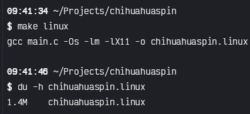

# chihuahuaspin.c

Inspired by [this post by @linuxenjoyer@blahaj.zone](https://wetdry.world/@linuxenjoyer@blahaj.zone/112790311937674200) about [this website](http://chihuahuaspin.com).

This was cobbled together in around 2 hours just after I decided I was going to make my night a productive night for my game, sigh...

I wrote it all in ANSI C because I'm a nerd and I love making myself suffer, by the way, it could theoretically be compiled to be 100% static for linux.

It weighs around 1.4MB, because GIFs suck and we should stop using them.


This program has no Wayland support, I am inmensely sorry; I hadn't used Fenster before but it was quite cool tbh.


```shell
make linux
stat chihuahuaspin.linux

make macos
stat chihuahuaspin.mach

make windows
stat chihuahuaspin.exe

# if you have tcc installed, you can run it like
chmod +x main.c
./main.c

# if you want to regenerate the GIF data or, perhaps, use your own:
make gif
stat spin.gif.h
```
